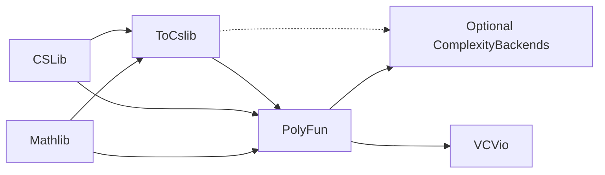

# PolyFun

**Typed interaction, programs, and machines in Lean 4.**

PolyFun is a library for describing how programs and systems interact, giving
those interactions different implementations, and proving the relationships
between them. An **interface** specifies requests and their response types;
a **program** chooses requests based on earlier answers; a **handler** supplies
the answers. Explicit-state machines and interaction trees provide other views
of the same behavior.

This foundation supports effect handlers, programming-language semantics,
stateful systems, and compositional protocol models. It grew out of
[VCVio](https://github.com/Verified-zkEVM/VCVio), which uses it for cryptography.
You can use PolyFun without probabilistic or cryptographic semantics.

[Getting started](docs/getting-started.md) · [Documentation](docs/README.md) ·
[API reference](https://verified-zkevm.github.io/PolyFun/docs/) ·
[Examples](Examples/README.md)

## What the library provides

| I want to… | Main concepts | Start here |
|---|---|---|
| Describe typed requests and translate interfaces | `PFunctor`, lenses, charts; indexed `IPFunctor` | [Polynomial functors](docs/guides/pfunctor.md), [indexed interfaces](docs/guides/ipfunctor.md) |
| Write programs independently of their implementations | `FreeM`, `Handler`, paths, cursors, structural replay | [First program](docs/tutorials/first-program.md), [free programs](PolyFun/PFunctor/Free/Basic.lean) |
| Model continuing interaction or explicit machine state | `Resumption`, `ITree`, `DynSystem`, `DynComputation` | [Choosing a model](docs/guides/computation-models.md), [interaction trees](docs/tutorials/interaction-trees.md), [execution](docs/guides/execution.md) |
| Describe protocols and compose open systems | `TypeTree`, decorations, strategies, concurrent processes, `OpenTheory` | [Interaction](docs/guides/interaction.md), [open systems](docs/guides/open-systems.md) |
| Prove properties through support or weakest preconditions | Exact monadic support, ordered monad algebras, `vcgen` bridges | [Program logic](docs/guides/program-logic.md) |
| Constrain implementations and account for their resources | `StepClass`, realizations, bounded execution, quantitative certificates | [Realizability](docs/guides/realizability.md) |

The common mathematical interface is a **polynomial functor**: a type `A` of
requests and a response family `B : A → Type`. Its action on a continuation
result type `X` is `Σ a : A, (B a → X)`. In mathematical terminology, requests
are *positions* and responses are *directions*. You can begin with the example
below and learn the categorical vocabulary as needed.

## PolyFun, its dependencies, and VCVio

| Library | What it supplies |
|---|---|
| [Mathlib](https://github.com/leanprover-community/mathlib4) | Polynomial functors, W-types and M-types, mathematical structures, and supporting theory |
| [CSLib](https://github.com/leanprover/cslib) | The upstream free monads and shared computer-science infrastructure |
| **PolyFun** | Handlers, lenses, paths, computation-model connections, interaction frameworks, generic program logic, and realizability |
| `ToCslib` | Local additions staged for upstream: free-monad and loop laws, an order bridge, bitvector and polynomial lemmas |
| `ComplexityBackends` | Optional concrete complexity backends, one subdirectory per machine model, instantiating PolyFun's quantitative realizability |
| [VCVio](https://github.com/Verified-zkEVM/VCVio) | Probability semantics, cryptographic experiments, security definitions, reductions, and cryptographic applications |



For example, VCVio's `OracleComp` uses the upstream `PFunctor.FreeM` datatype,
and its `QueryImpl` is definitionally a PolyFun handler. VCVio adds the
interpretations and definitions needed to reason about cryptographic security.
Generic program logic and resource accounting already live in PolyFun;
probability, cryptographic adversary classes, and security guarantees require
the additional downstream semantics. See [the detailed ownership guide](docs/guides/polyfun-and-vcvio.md).

## Get started

Install Lean and Lake using the [Lean setup guide](https://leanprover-community.github.io/get_started.html),
then build this repository:

```sh
git clone https://github.com/Verified-zkEVM/PolyFun.git
cd PolyFun
lake exe cache get
lake build
lake build PolyFunExamples
```

Open the folder in VS Code with the Lean 4 extension. The pinned compiler is
recorded in [`lean-toolchain`](lean-toolchain); Mathlib and CSLib revisions are
recorded in [`lakefile.toml`](lakefile.toml). The cache command downloads
precompiled dependencies. `lake build` builds the generic library, while
`PolyFunExamples` builds the optional tutorials and Parliament library.

To use the development version from another Lake project, match its toolchain
and add:

```toml
[[require]]
name = "PolyFun"
git = "https://github.com/Verified-zkEVM/PolyFun.git"
rev = "main"
```

Run `lake update PolyFun`, then `lake exe cache get` and `lake build`.
Keep the resolved `lake-manifest.json` under version control, or pin a tested
commit or release tag in the declaration. This README describes its adjacent
source; read older releases' documentation at their tags. The
[setup guide](docs/getting-started.md#add-polyfun-to-your-project) includes the
`lakefile.lean` version and explains imports and version matching.

## A program, a handler, and a proof

This program's first answer determines its second request. The handler answers
each request by adding one. `Id` means the interpretation has no further effects.

<!-- lean-example: Examples/Tutorials/Requests.lean#README -->
```lean
import PolyFun.PFunctor.Free.Basic
import PolyFun.PFunctor.Handler

/-- A request is a natural number; its response is another natural number. -/
abbrev Request : PFunctor := ⟨Nat, fun _ => Nat⟩

/-- The first answer determines the second request. -/
def twoRequests : PFunctor.FreeM Request (Nat × Nat) := do
  let first ← PFunctor.FreeM.lift (P := Request) 3
  let second ← PFunctor.FreeM.lift (P := Request) first
  return (first, second)

/-- This handler answers a request by incrementing it. -/
def increment : PFunctor.Handler Id Request := fun n => n + 1

example : twoRequests.liftM increment = (4, 5) := rfl
```

Save this as `Main.lean` in the repository and run `lake env lean Main.lean`.
The example is checked in [Requests.lean](Examples/Tutorials/Requests.lean).
The [walkthrough](docs/tutorials/first-program.md) changes the handler to obtain
`(6, 12)` from the same program, then explains stateful and effectful handlers.

## Executable case study

[Parliament](Examples/Parliament/README.md) uses indexed interfaces, certified
histories, dynamical machines, and interchangeable handlers to run a bounded
meeting model and request draft minutes. Its guide gives the modeled assumptions
and proof boundaries. Build it with `lake build PolyFunExamples polyfun-parliament`,
then run `lake exe polyfun-parliament --help`.

## Reading routes

- **New to Lean or this library:** [setup](docs/getting-started.md) →
  [first program](docs/tutorials/first-program.md) →
  [counter machine](Examples/Tutorials/Machines.lean) →
  [choosing a computation model](docs/guides/computation-models.md).
- **Familiar with Mathlib or CSLib:** [repository map](docs/reference/repo-map.md) →
  [polynomial API](docs/guides/pfunctor.md) →
  [model correspondences](docs/guides/computation-models.md) →
  [mathematical references](docs/reference/mathematical-background.md).
- **Interested in protocols:** [interaction shapes and strategies](docs/guides/interaction.md) →
  [execution networks](docs/guides/execution.md) →
  [open composition and observation](docs/guides/open-systems.md) →
  [the VCVio boundary](docs/guides/polyfun-and-vcvio.md).
- **Contributing:** [contribution guide](CONTRIBUTING.md) →
  [validation](docs/development/validation.md) →
  [public module APIs](docs/development/module-api.md).

The [documentation hub](docs/README.md) also indexes notation, bisimulation,
realizability, and program logic. Prefer specific module imports while
working; `import PolyFun` exposes the full generic library. Optional concrete
backends use `import ComplexityBackends`. The [repository map](docs/reference/repo-map.md)
explains the separate library targets.

## Status and contributions

[CI](https://github.com/Verified-zkEVM/PolyFun/actions/workflows/ci.yml) builds the
library and runs tests, linters, and an axiom audit. The audit rejects `sorry`
and dependencies on non-standard axioms; ordinary Lean foundational axioms
remain allowed. The [validation guide](docs/development/validation.md) explains
the exact checks. APIs evolve with the pinned Lean ecosystem, so dependency
upgrades should include a build of your own consumers.

Contributions are welcome through [GitHub issues](https://github.com/Verified-zkEVM/PolyFun/issues)
and pull requests. Read [CONTRIBUTING.md](CONTRIBUTING.md) for scope, style,
attribution, and review expectations. [AGENTS.md](AGENTS.md) contains the
repository's agent instructions. Foundational papers and attribution are
collected in [REFERENCES.md](REFERENCES.md).

## License

[Apache-2.0](LICENSE).
