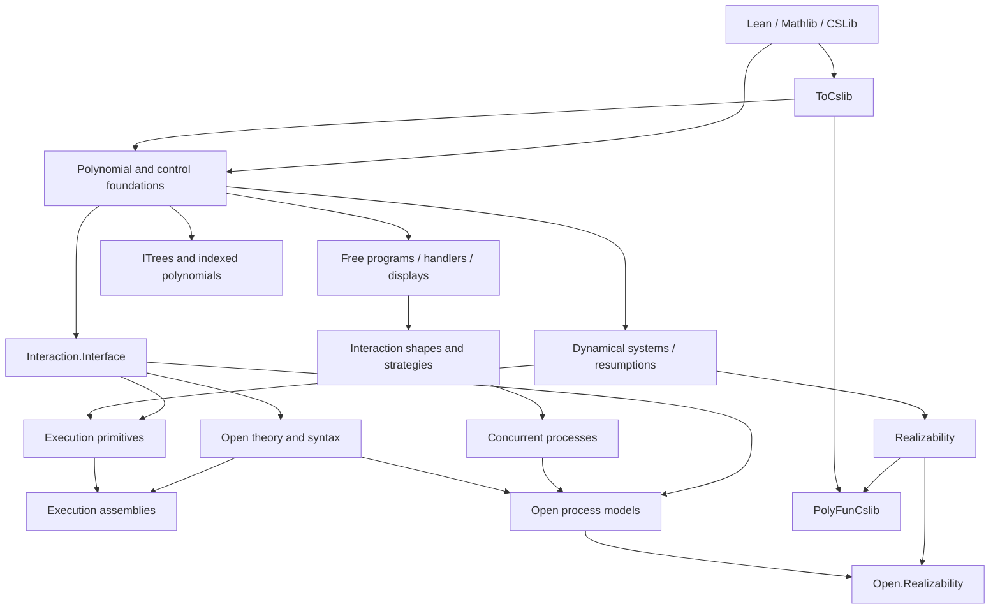

# Repository map

The repository contains several Lake libraries. Dependencies flow from shared
foundations into specialized interpretations. Choose an import by the concept
it provides, rather than importing the whole project while developing a module.

## Library targets

| Target | Purpose | Build or import |
|---|---|---|
| `PolyFun` | Generic polynomial, interaction, logic, and realizability library | Default `lake build`; `import PolyFun` or a specific module |
| `ToCslib` | Upstream staging: free-monad and loop laws, order bridge, machine/complexity theory | `lake build ToCslib`; specific `ToCslib.*` imports |
| `PolyFunCslib` | Optional concrete realizability adapters | `lake build PolyFunCslib`; `import PolyFunCslib` |
| `PolyFunExamples` | Human-facing checked tutorials under `Examples/` | `lake build PolyFunExamples`; `import Examples.Tutorials.Requests` |
| `PolyFunTest` | Regression tests, adversarial cases, and ordinary-import consumers | `lake test` |

`PolyFun.lean` and `ToCslib.lean` are generated import indexes. The optional
adapter and examples are outside the `PolyFun` umbrella. `PolyFunTest` can
consume examples, but production never depends on examples or tests.

## Find the right module

| Subject | Entry point | Guide |
|---|---|---|
| Polynomial interfaces and morphisms | [PFunctor basics](../../PolyFun/PFunctor/Basic.lean), [lens laws](../../PolyFun/PFunctor/Lens/Basic.lean) | [Polynomial functors](../guides/pfunctor.md) |
| Free programs and handlers | [Free basics](../../PolyFun/PFunctor/Free/Basic.lean), [handlers](../../PolyFun/PFunctor/Handler.lean) | [First program](../tutorials/first-program.md) |
| State-dependent interfaces | [Indexed basics](../../PolyFun/IPFunctor/Basic.lean) | [Indexed polynomials](../guides/ipfunctor.md) |
| Behaviors and explicit-state machines | [Resumptions](../../PolyFun/PFunctor/Resumption.lean), [dynamical systems](../../PolyFun/PFunctor/Dynamical/Basic.lean) | [Computation models](../guides/computation-models.md) |
| Interaction trees and recursion | [ITree basics](../../PolyFun/ITree/Basic.lean) | [Interaction trees](../guides/itree.md) |
| Protocol shapes and strategies | [TypeTree](../../PolyFun/Interaction/Basic/TypeTree.lean) | [Interaction](../guides/interaction.md) |
| Two-party, multiparty, concurrent interaction | `Interaction/TwoParty`, `Multiparty`, `Concurrent` | [Interaction](../guides/interaction.md) |
| General interfaces and directed boundaries | [Interface](../../PolyFun/Interaction/Interface.lean) | [Execution](../guides/execution.md) |
| Executable reactive/request networks | `Interaction/Execution` | [Execution](../guides/execution.md) |
| Open composition, contextual emulation, and observations | [OpenTheory](../../PolyFun/Interaction/Open/OpenTheory.lean), [OpenProcess](../../PolyFun/Interaction/Open/OpenProcess.lean) | [Open systems](../guides/open-systems.md) |
| Support and weakest preconditions | [Ordered algebras](../../PolyFun/Control/Monad/Algebra.lean), [support](../../PolyFun/Control/Monad/Support.lean) | [Program logic](../guides/program-logic.md) |
| Admissible implementations and resources | [Realizability](../../PolyFun/Realizability/Basic.lean), [quantitative certificates](../../PolyFun/Realizability/Quantitative.lean) | [Realizability](../guides/realizability.md) |

`Control/` also holds reusable monad, comonad, coalgebra, and LTS infrastructure.
`Logic/` holds small logic helpers. `Complexity/` supplies resource-bound syntax;
concrete machine complexity is staged separately under `ToCslib/Computability`.

## Conceptual layering

Arrows mean “is used by”; they do not assert equivalence of the objects.

The free-monad slice of `ToCslib` is used by PolyFun. Its machine modules are
imported explicitly by optional adapters, rather than introducing a concrete
backend into the generic umbrella. `ToCslib` never imports PolyFun.

`Interaction.Interface` exposes `Interaction.Interface` and
`Interaction.PortBoundary`. Runtime declarations use `Interaction.Execution`;
composition, open-process, and observation declarations use `Interaction.Open`.
The explicit `Open.Realizability` bridge connects open processes to realizability.
Nothing under `PFunctor/` or `ITree/` depends on `Realizability/`.

The `Std.Do` and tactic import boundaries remain restricted to the
[program-logic kernel](../guides/program-logic.md#the-stddo-quarantine).
Every Lean source uses module mode; see [public APIs](../development/module-api.md)
for imports, transparency, and exposed reducer bodies.

## Supporting files

- `docs/`: tutorials, guides, reference, and contributor documentation.
- `scripts/`: recurring validation and generation workflows.
- `.github/workflows/`: build, test, lint, axiom, documentation, and release checks.
- `test/DocumentationConsumer/`: a separate Lake consumer of the public tutorial and interaction APIs.

See [generated files](../development/generated-files.md) before changing an
umbrella, and [PolyFun and VCVio](../guides/polyfun-and-vcvio.md) before adding
an interpretation whose meaning depends on cryptographic semantics.
