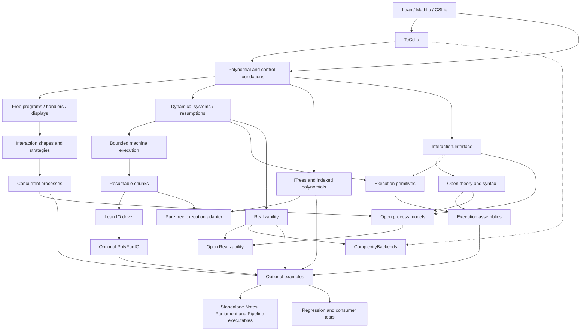

# Repository map

The repository contains several Lake libraries. Dependencies flow from shared
foundations into specialized interpretations. Choose an import by the concept
it provides, rather than importing the whole project while developing a module.

## Library targets

| Target | Purpose | Build or import |
|---|---|---|
| `PolyFun` | Generic polynomial, interaction, logic, and realizability library | Default `lake build`; `import PolyFun` or a specific module |
| `ToCslib` | Upstream staging: free-monad and loop laws, order bridge, bitvector and polynomial lemmas | `lake build ToCslib`; specific `ToCslib.*` imports |
| `ComplexityBackends` | Optional concrete complexity backends, one subdirectory per machine model | `lake build ComplexityBackends`; `import ComplexityBackends` or a specific `ComplexityBackends.CslibSingleTape.*` module |
| `PolyFunIO` | Optional typed console forms and checked storage | `lake build PolyFunIO`; `import PolyFunIO` |
| `PolyFunExamples` | Small checked tutorials only | `lake build PolyFunExamples`; `import Examples.Tutorials.Requests` |
| `Parliament` | Standalone case-study package | `lake -d Examples/Parliament build`; `import Parliament` inside the package |
| `Notes` | Standalone local CLI package | `lake -d Examples/Notes build`; `import Notes` inside the package |
| `Pipeline` | Standalone read-only routed file report | `lake -d Examples/Pipeline build`; `import Pipeline` inside the package |
| `PolyFunTest` | Regression tests, adversarial cases, and ordinary-import consumers | `lake test` |

`PolyFun.lean`, `ToCslib.lean`, and `ComplexityBackends.lean` are generated import
indexes. The optional backends and examples are outside the `PolyFun` umbrella.
`PolyFunTest` can consume examples, but production never depends on examples or tests.

`PolyFunExamples` uses tutorial globs only. Each application has its own generated
umbrella, executable, tests and lint target. Applications do not depend on one another.
Notes and Parliament use `PolyFunIO`, which imports core but is never imported by `PolyFun`
or `ToCslib`. Pipeline consumes handled reactive assemblies directly.
Example and test imports never flow back into production or the shared IO library.

## Find the right module

| Subject | Entry point | Guide |
|---|---|---|
| Polynomial interfaces and morphisms | [PFunctor basics](../../PolyFun/PFunctor/Basic.lean), [lens laws](../../PolyFun/PFunctor/Lens/Basic.lean) | [Polynomial functors](../guides/pfunctor.md) |
| Free programs and handlers | [Free basics](../../PolyFun/PFunctor/Free/Basic.lean), [handlers](../../PolyFun/PFunctor/Handler.lean) | [First program](../tutorials/first-program.md) |
| State-dependent interfaces | [Indexed basics](../../PolyFun/IPFunctor/Basic.lean) | [Indexed polynomials](../guides/ipfunctor.md) |
| Behaviors and explicit-state machines | [Resumptions](../../PolyFun/PFunctor/Resumption.lean), [dynamical systems](../../PolyFun/PFunctor/Dynamical/Basic.lean) | [Computation models](../guides/computation-models.md) |
| Interaction trees and recursion | [ITree basics](../../PolyFun/ITree/Basic.lean) | [Interaction trees](../guides/itree.md) |
| Interpreting trees into monads | [Interpretation](../../PolyFun/ITree/Interp/Defs.lean), [laws](../../PolyFun/ITree/Interp/Laws.lean) | [Interaction trees](../guides/itree.md#interpreting-into-a-monad) |
| Exact resumable tree execution | [Tree execution](../../PolyFun/ITree/Execution.lean), [chunks](../../PolyFun/PFunctor/Dynamical/DynComputation/Resumable.lean) | [Execution](../guides/execution.md#resumable-execution) |
| Iterative monads and transformer loops | [Iteration](../../PolyFun/Control/Monad/Iter.lean), [transformer instances](../../PolyFun/Control/Monad/Iter/Instances.lean) | [Interaction trees](../guides/itree.md#iterative-monads) |
| Protocol shapes and strategies | [TypeTree](../../PolyFun/Interaction/Basic/TypeTree.lean) | [Interaction](../guides/interaction.md) |
| Two-party, multiparty, concurrent interaction | `Interaction/TwoParty`, `Multiparty`, `Concurrent` | [Interaction](../guides/interaction.md) |
| General interfaces and directed boundaries | [Interface](../../PolyFun/Interaction/Interface.lean) | [Execution](../guides/execution.md) |
| Executable reactive/request networks | `Interaction/Execution` | [Execution](../guides/execution.md) |
| Open composition, contextual emulation, and observations | [OpenTheory](../../PolyFun/Interaction/Open/OpenTheory.lean), [OpenProcess](../../PolyFun/Interaction/Open/OpenProcess.lean) | [Open systems](../guides/open-systems.md) |
| Support and weakest preconditions | [Ordered algebras](../../PolyFun/Control/Monad/Algebra.lean), [support](../../PolyFun/Control/Monad/Support.lean) | [Program logic](../guides/program-logic.md) |
| Admissible implementations and resources | [Realizability](../../PolyFun/Realizability/Basic.lean), [quantitative certificates](../../PolyFun/Realizability/Quantitative.lean), [description measures](../../PolyFun/Realizability/Quantitative/Description.lean) | [Realizability](../guides/realizability.md) |

`Control/` also holds reusable monad, comonad, coalgebra, and LTS infrastructure.
`Logic/` holds small logic helpers. `Complexity/` supplies resource-bound syntax;
concrete machine complexity lives in the optional `ComplexityBackends` library.

## Conceptual layering

Arrows mean “is used by”; they do not assert equivalence of the objects.

```mermaid
flowchart TD
  U[Lean / Mathlib / CSLib] --> T[ToCslib]
  U --> P[Polynomial and control foundations]
  T --> P
  P --> F[Free programs / handlers / displays]
  P --> D[Dynamical systems / resumptions]
  D --> BD[Bounded machine execution]
  BD --> RC[Resumable chunks]
  RC --> IO[Lean IO driver]
  RC --> TE[Pure tree execution adapter]
  P --> I[ITrees and indexed polynomials]
  I --> TE
  F --> S[Interaction shapes and strategies]
  S --> C[Concurrent processes]
  P --> B[Interaction.Interface]
  B --> O[Open theory and syntax]
  B --> E[Execution primitives]
  D --> E
  O --> A[Execution assemblies]
  E --> A
  B --> OP[Open process models]
  C --> OP
  O --> OP
  D --> R[Realizability]
  R --> OR[Open.Realizability]
  OP --> OR
  R --> AD[ComplexityBackends]
  T -.-> AD
  I --> EX[Optional examples]
  A --> EX
  C --> EX
  R --> EX
  IO --> PIO[Optional PolyFunIO]
  PIO --> EX
  EX --> CLI[Standalone Notes, Parliament and Pipeline executables]
  EX --> TEST[Regression and consumer tests]
```

PolyFun imports the `ToCslib` modules it needs explicitly. `ComplexityBackends`
hosts one self-contained subdirectory per backend (`CslibSingleTape/` grounds
encoded polynomial-time families, machine constructions, and a counting
separation in cslib's single-tape machines, then certifies PolyFun step maps,
bridges its P/poly certificates to per-parameter program witnesses, and proves
per-step cost adequacy); a new backend is a sibling subdirectory, never a
module inside `PolyFun/`.
`ToCslib` never imports PolyFun or a backend, and PolyFun never imports a
backend; `scripts/check-modules.sh` enforces both.

`Interaction.Interface` exposes `Interaction.Interface` and
`Interaction.PortBoundary`. Runtime declarations use `Interaction.Execution`;
composition, open-process, and observation declarations use `Interaction.Open`.
The explicit `Open.Realizability` bridge connects open processes to realizability.
Nothing under `PFunctor/` or `ITree/` depends on `Realizability/`.

The `Std.Do` and tactic import boundaries remain restricted to the
[program-logic kernel](../guides/program-logic.md#the-stddo-quarantine).
Every Lean source uses module mode; see [public APIs](../development/module-api.md)
for imports, transparency, and exposed reducer bodies.

## Supporting files

- `docs/`: tutorials, guides, reference, and contributor documentation.
- `scripts/`: recurring validation and generation workflows.
- `.github/workflows/`: build, test, lint, axiom, documentation, and release checks.
- `test/DocumentationConsumer/`: a separate Lake consumer of the public tutorial and interaction APIs.
- `Examples/Parliament/`, `Examples/Notes/` and `Examples/Pipeline/`: independent packages and ordinary-import tests.

Within Notes, `Notes.Dialogue` builds typed forms, `Notes.App` defines the effectful
machine without performing IO, and `Notes.Runtime` supplies console/filesystem handlers
and executable demos. `Notes.Walkthrough` and its correctness companion remain
handler-polymorphic. Pipeline likewise keeps `run` and `runChunks` in `Pipeline.Network`;
`Pipeline.App` owns real file reads and reporting. Application tests can import these
computational layers without importing the executable runtime.

Tutorial modules retain the `Examples.Tutorials.*` import paths and use
`PolyFunExamples.<TutorialName>` namespaces. The [examples index](../../Examples/README.md)
owns the collection's reading order and application chooser.

See [generated files](../development/generated-files.md) before changing an
umbrella, and [PolyFun and VCVio](../guides/polyfun-and-vcvio.md) before adding
an interpretation whose meaning depends on cryptographic semantics.
